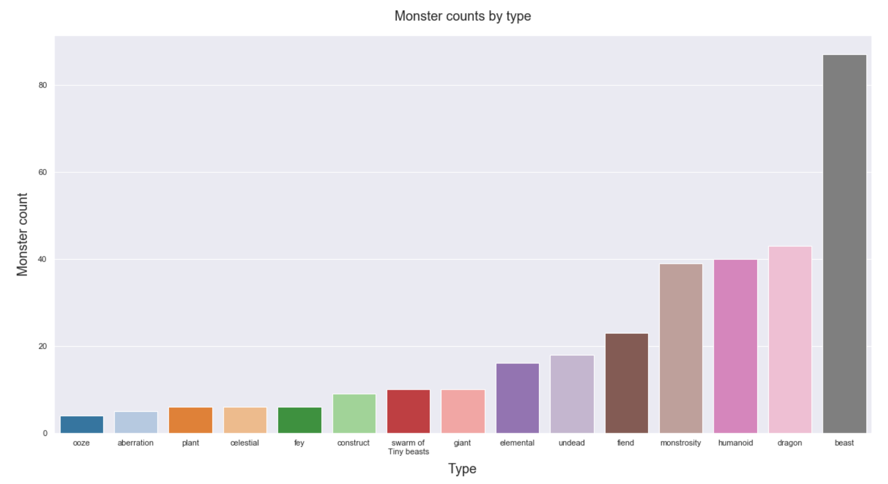
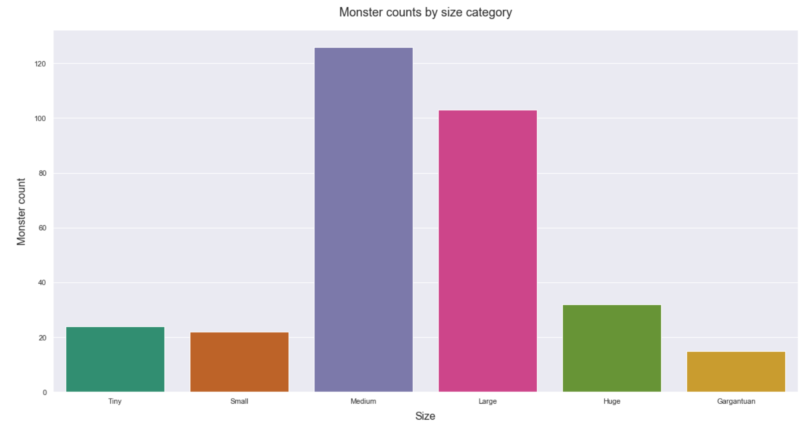
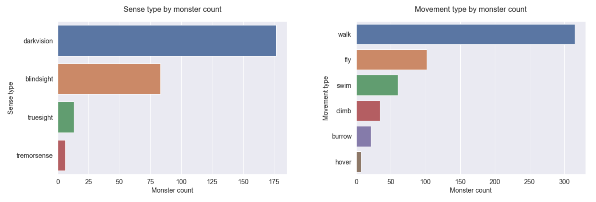
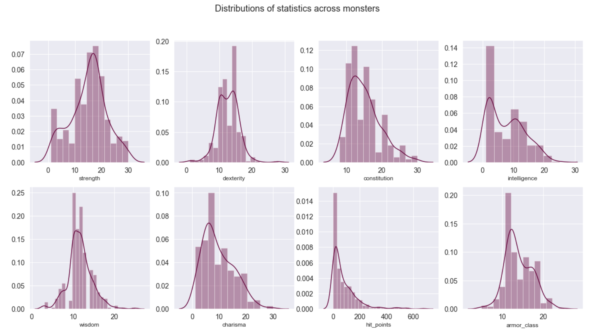
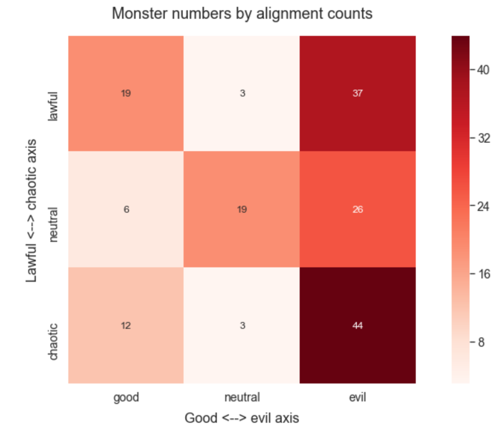
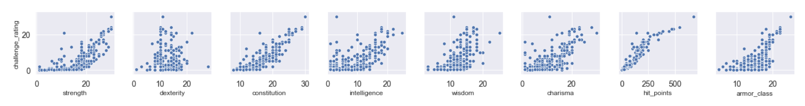
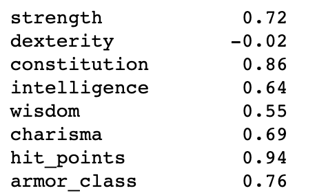
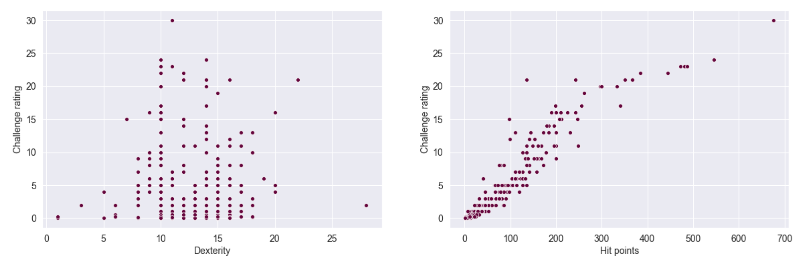

# Dungeons and Data

This notebook focuses on accessing the [Dungeons & Dragons (Fifth Edition) API](https://www.dnd5eapi.co/) and exploring the different types of monsters in the game.

I wrote about this project on [Dev.to]().

## Motivation

I created this project for three reasons:

1. As part of the Udacity Data Scientist Nanodegree

2. To explore an unfamiliar API

3. To practice data exploration and unsupervised learning techniques

## Questions

The project focused on two main questions:

1. Are there neglected monster niches?
People create "homebrew" D&D content all of the time, developing new quests and classes and monsters to put in their games. If there are particular kinds or styles of monster that are relatively uncommon, it could be useful to identify them, so that people creating new content can target the most untrodden ground.

2. Are the raw stats (such as strength and charisma) strongly linked to challenge rating (a monster's canonical difficulty to overcome)?
Challenge rating seems - from an outside perspective - to be a bit of an arbitrary figure. Having some idea of how closely challenge rating is linked to monster stats could help people planning D&D games to balance them more effectively.

## Data Source

The data for this project was pulled from the [Dungeons and Dragons 5th edition API](https://www.dnd5eapi.co/). It's a really great API to work with - the documentation is very clear, and there are no fiddly authorisation problems.

The dataset used consisted of details on 322 monsters.

## Libraries used

The following libraries were used to complete this project:

- Pandas
- Requests
- Collections
- Textwrap
- Seaborn
- Matplotlib
- Sklearn

## Files involved

- All coded written during this project is stored in the [notebook file](./Dungeons%20and%20Data.ipynb)

## Results

### Are there neglected monster niches?

I made several visualisations to see if any particular gaps jumped out. I started with monster type, looking for any under-used types.

The most common types were beast (a catch-all category) and dragon (eponymous, so justified). Only one obvious under-used niche was visible: though "fiend" and "celestial" are counterparts, there were relatively few celestial type monsters.

Monster sizes followed a reasonable and straight-forward pattern, with the majority of monsters being human-sized or larger, with only a few extremely large monsters available as significant challenges.

Plotting the counts for different monster senses and movement showed that there are comparatively few burrowing monsters; this seems like a profitable niche for a game set rather frequently underground.

The distributions of values for stat columns showed that the distribution for intelligence is skewed towards lower values than the other stats. This suggests that the majority of monsters focus on physical attributes; one potential niche here is monsters that focus on more intellectual challenges, rather than just hitting things with their axes.

As might be expected, the most common alignments for monsters were evil ones. However, I was surprised to find that good alignments were more common than neutral - other than "neutral neutral", all the neutral alignments contained only a small number of monsters.

#### Conclusions

There are several sorts of monster that seem under-represented, suggesting that - if new monsters are to be created - they would be most original and distinct from existing monsters if they had (some combination of) the following characteristics:

- burrowing
- able to sense vibrations in the earth
- Neutrally- or positively-aligned
- Focused on intellectual, rather than physical, prowess - higher scores in intelligence/wisdom

### Are the raw stats (such as strength and charisma) strongly linked to challenge rating (a monster's canonical difficulty to overcome)?

I plotted each stat against challenge rating (CR) to find the correlations.

I also calculated the numeric correlation.

Hit points and constitution were the most highly correlated to CR, while dexterity alone showed no meaningful correlation.

As always, correlation doesn't imply causation, but the correlation is extremely strong: as stats increase, CR also seems to increase.

I am unsure why dexterity does not show similar correlations to other stats; I think this might only be solvable with domain knowledge of exactly how dexterity works within the game in practice.

#### Conclusions

All the stats except dexterity were positively correlated - to a greater or lesser degree - with CR. As the stats increase, the monster becomes a more formidable challenge. This was to be expected, but the extremely high correlation shown by hit points is a little disappointing, as it suggests that the raw numbers are more important than the various abilities monsters have, which would make the game more shallow than ideal.

However, dexterity showed no positive correlation to CR, suggesting a more complex relationship than just `higher stats == higher CR`. There was also monster variation within other stats that didn't map onto CR, and some stats that had lower (albeit still positive) correlations. In all, while it's clear that there is a strong correlation between stats and CR, it's not a completely direct and simple link.