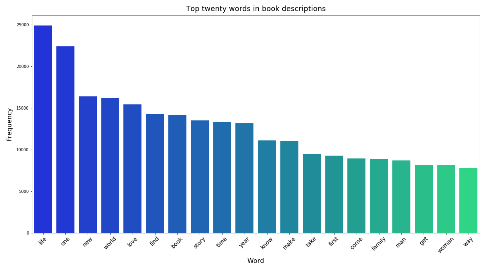
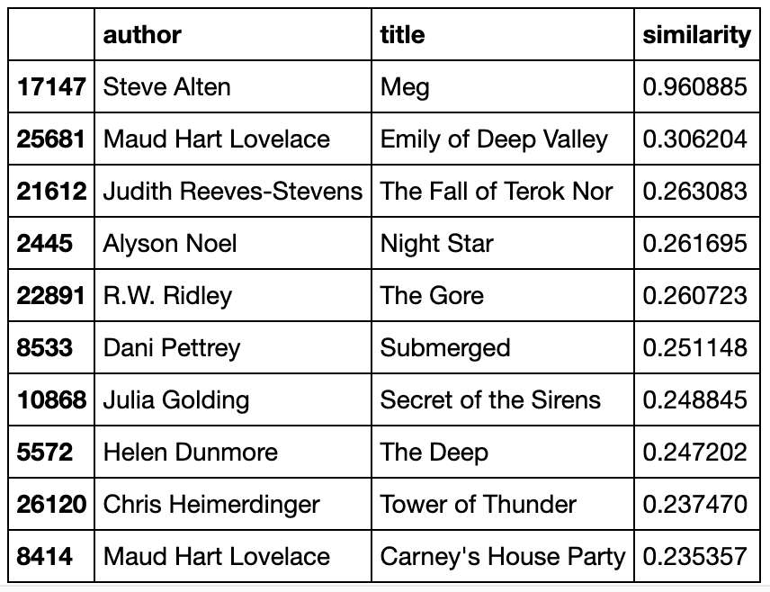

# Book Recommendations

This project explores a dataset of book recommendations, attempting to create a recommendation tool based on similarities between descriptions.

## Motivation

I created this project for three reasons:

1. As part of the Udacity Data Scientist Nanodegree

2. To explore how to use TF-IDF to calculate text similarities

3. To explore how useful book descriptions really are - product descriptions and reviews are constantly created and refined, used to direct readers or encourage sales. If they don't have the ability to successfully differentiate or group books, then the effort and time spent on them - by both authors and readers - is unwarranted.

## Business questions

The project focuses on three questions:

1. **What are the most frequent words in descriptions?**

    The most frequent words in book descriptions (once stop words have been removed) are those that have the least importance and discriminating power, as they will not distinguish one book from another effectively. Being able to identify these words could help authors and publishers write more useful book descriptions, avoiding words that are essentially filler terms.

2. **Can TF-IDF effectively distinguish between separate books based solely on descriptions?**

    Book descriptions are often short and may share significant vocabulary, particularly after cleaning and processing text to reduce dimensionality. There's no point in building a recommendation system based upon TF-IDF if the book descriptions, after cleaning, are not sufficiently distinct.

3. **Can book descriptions alone be used to make reasonable recommendations?**

    Recommendation systems are used in all sorts of customer-facing contexts; being able to recommend products to consumers based on their past behaviour or interests has obvious implications in terms of boosting sales and/or customer engagement.

## Data Source

The data used in this project was sourced from [Kaggle](https://www.kaggle.com/meetnaren/goodreads-best-books). The dataset file is not included in this repository because it is too large. 

The dataset consists of details on 50,000+ books, including titles, authors, and descriptions. These details were sourced from a list of popular books on Goodreads.

## Libraries used

The following libraries were used to complete this project:

- Pandas
- Re
- Langdetect
- NLTK
- Collections
- Seaborn
- Matplotlib
- Sklearn

## Files involved

- `Book Recommendations.ipynb`: the project notebook, containing all code
- `book_data.csv`: the dataset, sourced from Kaggle and not included in this repository due to size constraints
- `top_twenty_words.png`: a visualisation created during the project
- `meg_recommendations.png`: a table outputted during the project

## Results

1. The following visualisation shows the top twenty most frequent words in all book descriptions, after cleaning and processing of the data set.

2. In the final analysis, only 24 duplicates were found: 24 books with TF-IDF vectors that were identical to another book's description. These books all had extremely similar descriptions, so it is not surprising that the vectors were the same. The problem here is in the data, not the metrics: some books have non-specifc descriptions.

Overall, TF-IDF sufficiently differentiates between different books, with only very minor confusion. This means that is a viable choice for building the recommendation system.

3. When tested with the description of Steve Alten's *Meg*, the recommendation system output the following table:

The most similar book to Meg was Meg, which shows that the recommender is working. The other books suggested were generally reasonable ones; for example, Submerged by Dani Pettrey is also about horror in the depths.

Emily of Deep Valley is not particularly similar in tone or theme, but both books have the word "deep" frequently in their descriptions. This shows one weakness of TF-IDF; it picks up on relative word importance, but struggles with words being used in different contexts.

A second book - *The Priest of Bones* by Pete McLean - had the following titles recommended:

1. Born, by A.E. Watson
2. Treasure, by S.  Smith
3. There's No Place Like Here, by Cecelia Ahern
4. Reaper's Gale, by Steven Erikson
5. Tokyo Crazy Paradise, Vol. 1, by Yoshiki Nakamura

All of these books are reasonable recommendations in either genre or tone.

This project has successfully created a recommendation system, though it does still have flaws. Potential refinements would be to

- Consider genre, and only recommend books in a similar category, even if highly similar
- Remove named entities as a processing step; character names are frequent in descriptions but don't suggest anything about themes etc.
- Use longer text - descriptions might not have much discerning power compared to reviews or actual excerpts.

